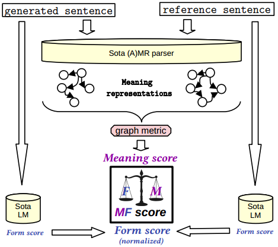
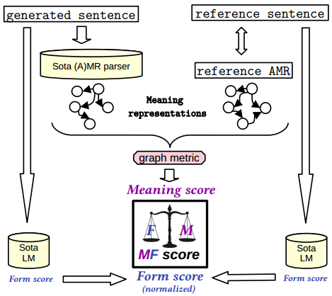

# MF score for explainable evaluation of text generation

For some, the **Form** of a generated text may be very important, for others, the **Meaning** may be most important. 

Most, however, take a balanced approach and rate a text with regard to both **Form** and **Meaning**.

This repo **aims at better assessing what an NLG system excels in**: Form or Meaning?


## Preparation

We recommend setting up a virtual environment to install the requirements

1. run `pip install -r requirements.txt`. 

2. run `pip install -r requirements_no_deps.txt --no-deps`

3. download spacy model `en_core_web_sm`  (it's used for true-casing): `python -m spacy download en_core_web_sm`

4. install [amrlib](https://github.com/bjascob/amrlib), and install a parser model. Simply follow their instructions (I tested with version `0.5.0`).

5. clone [amr-metric-suite](https://github.com/flipz357/amr-metric-suite) here: `git clone https://github.com/flipz357/amr-metric-suite`


## MF score for evaluation of general sentence generation



Simply call:
```
./mfscore_for_genSent_vs_refSent.sh <generated_file> <reference_file>
```
where `<generated_file>` and `<reference_file>` are files that contain one sentence per line. See `example.txt`


## MF score for evaluation of AMR-to-text generation



Simply call:
```
./mfscore_for_genSent_vs_refAMR.sh <generated_file> <reference_file>
```
where `<generated_file>` contains one sentence per line and `<reference_file>` contains AMRs separated by an empty line (standard AMR Sembank, see `example.txt`).


## Fine-grained semantic analysis (e.g., coref F1, Word senses F1, SRL F1, etc.)

If you want to run the fine grained semantic evaluation (e.g., how good is your generated text w.r.t. to coreference?), run

```
./fined_grained_semantic_analyis.sh <amr-file-pred> <amr-file-ref>
```

where both input files are AMR corpora (AMRs separated by an empty line, standard AMR Sembank, see `example.txt`). Chances are that you have already generated them when using the MF score, please look in `src/tmp/`.

## Additional information

### Using another parser

- currently the seq2seq parser based on t5 transformer is set as default, since it provides robust and good parses.
- other parsers can be used, 
    - if pre-installed (part of amrlib) then by setting `-parser_uri` in the main MF score scripts
    - if custom parser: just add another class in `src/sent_parsers.py` that has a function `parse_sents(strings)` that projects n strings onto n AMR graphs in Penman string format

### Using another LM to score Form

- currently GPT-2 base is used
    - but all unidirectional and bidirectional (->(Ro)BERT(a)-X-X) models that are part of huggingface library can be used by setting `-lm_uri` in the main MF score scripts
    - if you want custom form score: similar to custom parser just add another class in `src/sent_scorers.py` that has a function `score_sents(strings)` that projects the n strings onto n floats

### Speed of implementation

Current impementation is **not** optimised for speed. Consider

- **using GPU** (not needed but highly recommended.... both parser and LM will profit, see below)
- perhaps: bucketing sentences into buckets of same lengths so that the LMs can be used with mini-batches

Rough statistics for processing 1000 sentences of current implementation

|           |  cpu    |  gpu (Titan Xp)  |
| ---       |  ---    |  ---  |
|parse (t5) | 12000s  |  992s |
|S2match    | 110s    |  -    |

## Citation

If you like this project, please consider citing

```
@article{opitz2020towards,
  title={Towards a Decomposable Metric for Explainable Evaluation of Text Generation from AMR},
  author={Opitz, Juri and Frank, Anette},
  journal={arXiv preprint arXiv:2008.08896},
  year={2020}
}
```

### Change log

* version 0.0.1 released
